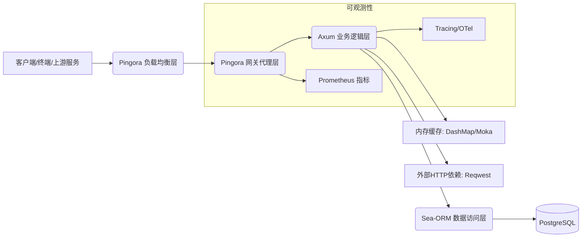
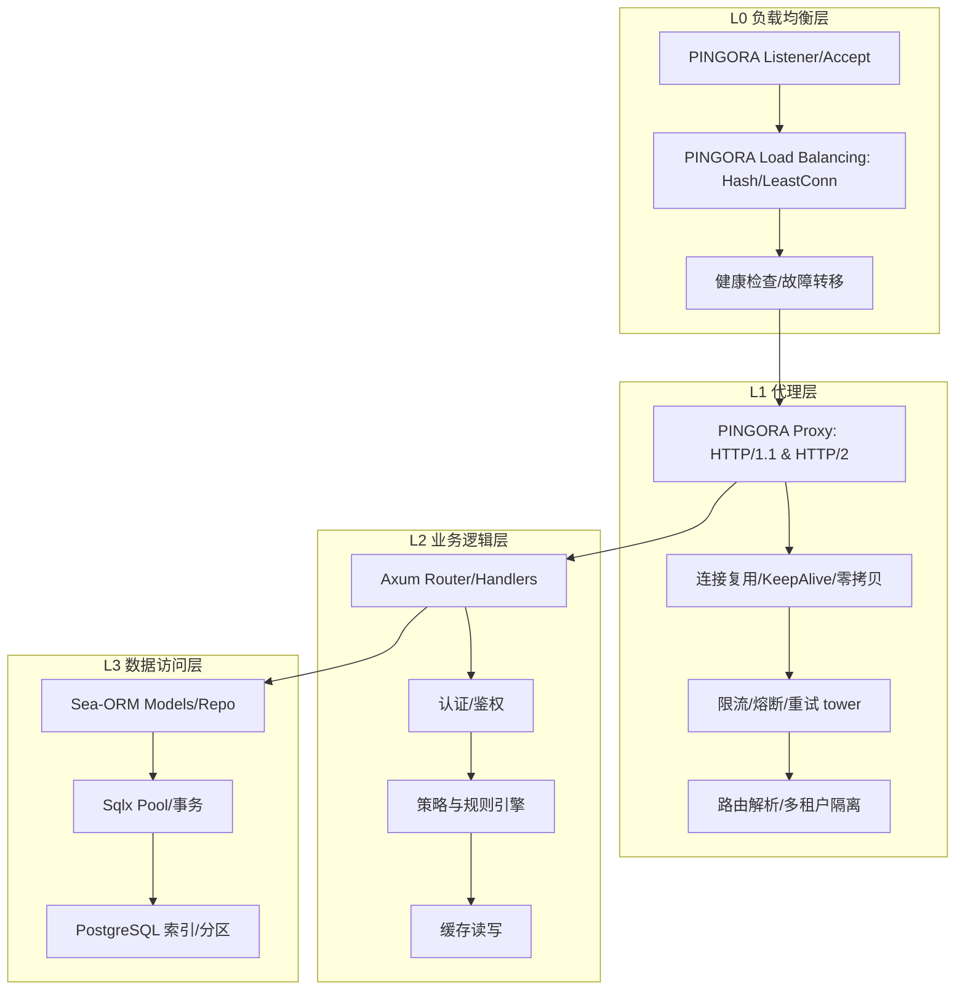
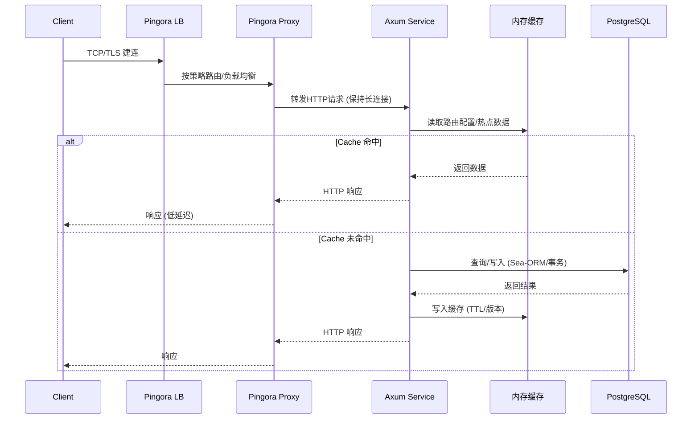

# Gateway 系统架构设计（Axum + Pingora + Sea-ORM + PostgreSQL + Reqwest）

## 目标与SLO
- 并发能力：≥ 10K QPS（稳定可持续）
- 端到端延迟：P50 ≤ 15ms，P95 ≤ 35ms，P99 ≤ 50ms
- 可用性：≥ 99.99%（月不可用时间约 ≤ 4.32 分钟）
- 监控与告警：完整覆盖请求、资源、错误、依赖与业务指标；分钟级告警响应

## 总览架构


## 分层架构图（逻辑分层）


## 核心组件交互流程（读路径）


## 高可用性设计
- 集群部署：
  - Pingora 前置多实例（N+1），多可用区部署，Anycast/IPVS/ECMP 提升入口冗余。
  - Proxy/Axum 层采用无状态水平扩展，Pod/进程数随负载自动伸缩。
  - PostgreSQL 主从复制（同步或异步，依据一致性需求），读写分离 + 只读副本。
- 故障转移：
  - Pingora 健康检查（active probing），失败阈值与恢复阈值分离，避免抖动。
  - 代理层使用 `tower::load_shed`、`tower::timeout`、`tower::retry`，实现退避重试与背压。
  - DB 层连接失败时，使用指数退避重试与熔断；只读查询自动切换到只读副本。
- 配置与热更新：
  - 路由/策略配置通过 `ArcSwap` + 版本化配置热替换，避免重启。
  - 滚动发布（maxUnavailable=0），金丝雀与灰度策略，支持快速回滚。

## 性能优化策略
- 网络与协议：
  - HTTP KeepAlive、连接复用、TCP FastOpen、HTTP/2 优先级（视客户端能力）。
  - 零拷贝转发、减少内存分配；开启 `hyper` 的高性能设置。
- 线程与调度：
  - `tokio` 多线程运行时，worker 线程 ≈ CPU 物理核心数。
  - 绑定关键任务到高优先级线程池（阻塞IO与CPU密集路径隔离）。
- 连接池与访问：
  - Sea-ORM/Sqlx 连接池：`max_connections = 4 * CPU * 节点数`（按容量压测校准）。
  - Reqwest 客户端池：按上游服务数与QPS配置并发与超时；连接重用与DNS缓存。
- 缓存策略：
  - 热点路由与鉴权数据使用本地缓存（`DashMap` 或 `moka` TTL/大小限制）。
  - 多级缓存：本地优先，必要时引入 Redis 作为共享缓存与失效协调。
- 结构化日志与指标：
  - 使用 `tracing` + `tracing-subscriber` 输出结构化日志；关键路径埋点。
  - 指标：QPS、延迟（p50/p95/p99）、错误率、池使用率、饱和度（CPU/内存/FD）。

## 配置参考（Release 编译）
```toml
[profile.release]
opt-level = 3
lto = "fat"
codegen-units = 1
panic = "abort"
strip = true
```

## 关键参数建议（首版上线）
- `TOKIO_WORKER_THREADS = <CPU核心数>`
- `DB_POOL_MAX = 64~256`（视节点与PG容量，压测校准）
- `HTTP_SERVER_KEEPALIVE = true`，`HTTP_IDLE_TIMEOUT = 30s`，`READ_TIMEOUT = 5s`，`WRITE_TIMEOUT = 5s`
- `RETRY_POLICY = 指数退避 (初始 50ms, 尝试 ≤ 3)`
- `CACHE_TTL_ROUTE = 60s`，`CACHE_TTL_AUTHZ = 10s`（与一致性需求匹配）

## 风险与缓解
- 热点写导致DB争用：采用批量与异步队列、合理索引与分区。
- 上游级联故障：启用熔断与隔离池，降级为本地缓存兜底。
- 配置错误风险：配置校验 + 双人审批 + 回滚预案。

## 结论
该架构在网络、并发、数据访问与缓存层面进行了全链路优化，并通过观测、弹性与故障转移机制保障 10K+ QPS、≤50ms 延迟与 99.99% 可用性目标的达成。