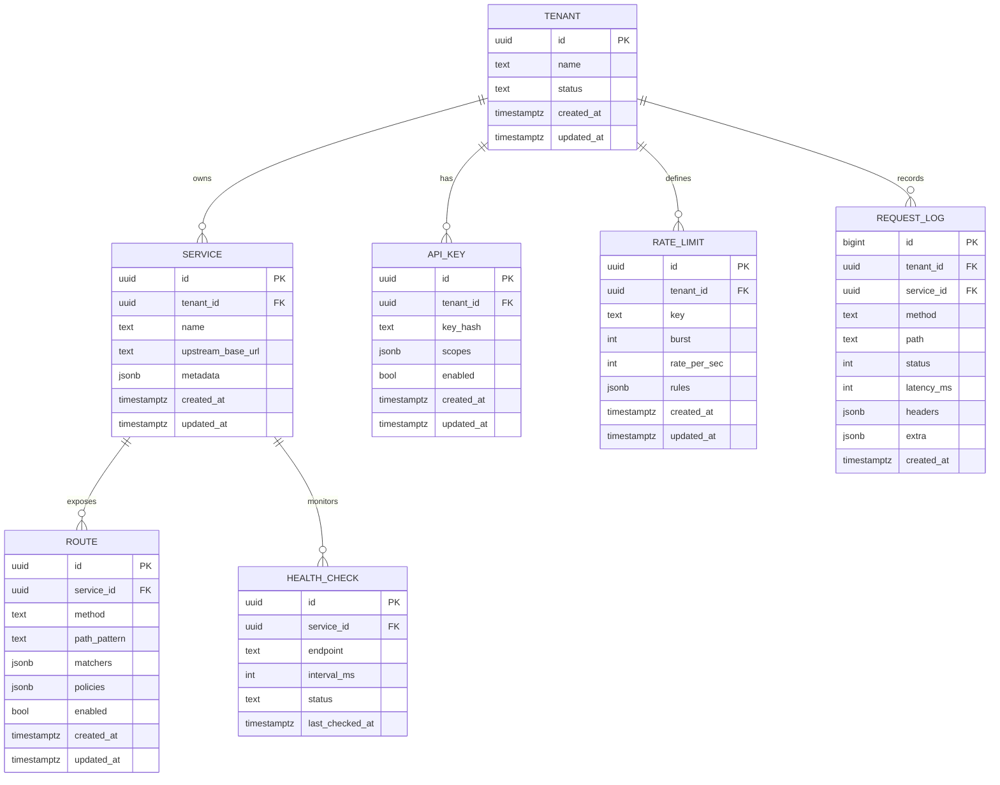

# 数据结构规范（PostgreSQL + Sea-ORM + 内存缓存 + DTO）

## 数据库 ER 图


## 主要数据表 DDL（含索引）
```sql
-- tenants
CREATE TABLE tenants (
  id uuid PRIMARY KEY,
  name text NOT NULL,
  status text NOT NULL DEFAULT 'active',
  created_at timestamptz NOT NULL DEFAULT now(),
  updated_at timestamptz NOT NULL DEFAULT now()
);
CREATE INDEX idx_tenants_status ON tenants(status);

-- services
CREATE TABLE services (
  id uuid PRIMARY KEY,
  tenant_id uuid NOT NULL REFERENCES tenants(id) ON DELETE CASCADE,
  name text NOT NULL,
  upstream_base_url text NOT NULL,
  metadata jsonb NOT NULL DEFAULT '{}',
  created_at timestamptz NOT NULL DEFAULT now(),
  updated_at timestamptz NOT NULL DEFAULT now()
);
CREATE INDEX idx_services_tenant ON services(tenant_id);
CREATE INDEX idx_services_name ON services(name);

-- routes
CREATE TABLE routes (
  id uuid PRIMARY KEY,
  service_id uuid NOT NULL REFERENCES services(id) ON DELETE CASCADE,
  method text NOT NULL,
  path_pattern text NOT NULL,
  matchers jsonb NOT NULL DEFAULT '{}',
  policies jsonb NOT NULL DEFAULT '{}',
  enabled boolean NOT NULL DEFAULT true,
  created_at timestamptz NOT NULL DEFAULT now(),
  updated_at timestamptz NOT NULL DEFAULT now()
);
CREATE INDEX idx_routes_service ON routes(service_id);
CREATE INDEX idx_routes_enabled ON routes(enabled);
CREATE INDEX idx_routes_path_pattern ON routes USING btree(path_pattern);
CREATE INDEX idx_routes_matchers ON routes USING gin(matchers);

-- api_keys
CREATE TABLE api_keys (
  id uuid PRIMARY KEY,
  tenant_id uuid NOT NULL REFERENCES tenants(id) ON DELETE CASCADE,
  key_hash text NOT NULL,
  scopes jsonb NOT NULL DEFAULT '[]',
  enabled boolean NOT NULL DEFAULT true,
  created_at timestamptz NOT NULL DEFAULT now(),
  updated_at timestamptz NOT NULL DEFAULT now()
);
CREATE UNIQUE INDEX uq_api_keys_key_hash ON api_keys(key_hash);
CREATE INDEX idx_api_keys_tenant ON api_keys(tenant_id);
CREATE INDEX idx_api_keys_enabled ON api_keys(enabled);

-- rate_limits
CREATE TABLE rate_limits (
  id uuid PRIMARY KEY,
  tenant_id uuid NOT NULL REFERENCES tenants(id) ON DELETE CASCADE,
  key text NOT NULL,
  burst int NOT NULL,
  rate_per_sec int NOT NULL,
  rules jsonb NOT NULL DEFAULT '{}',
  created_at timestamptz NOT NULL DEFAULT now(),
  updated_at timestamptz NOT NULL DEFAULT now()
);
CREATE INDEX idx_rate_limits_tenant_key ON rate_limits(tenant_id, key);
CREATE INDEX idx_rate_limits_rules ON rate_limits USING gin(rules);

-- health_checks
CREATE TABLE health_checks (
  id uuid PRIMARY KEY,
  service_id uuid NOT NULL REFERENCES services(id) ON DELETE CASCADE,
  endpoint text NOT NULL,
  interval_ms int NOT NULL,
  status text NOT NULL,
  last_checked_at timestamptz
);
CREATE INDEX idx_health_checks_service ON health_checks(service_id);
CREATE INDEX idx_health_checks_status ON health_checks(status);

-- request_logs（建议按时间分区或Hypertable）
CREATE TABLE request_logs (
  id bigserial PRIMARY KEY,
  tenant_id uuid NOT NULL REFERENCES tenants(id) ON DELETE CASCADE,
  service_id uuid NOT NULL REFERENCES services(id) ON DELETE CASCADE,
  method text NOT NULL,
  path text NOT NULL,
  status int NOT NULL,
  latency_ms int NOT NULL,
  headers jsonb NOT NULL DEFAULT '{}',
  extra jsonb NOT NULL DEFAULT '{}',
  created_at timestamptz NOT NULL DEFAULT now()
);
CREATE INDEX idx_request_logs_tenant_time ON request_logs(tenant_id, created_at DESC);
CREATE INDEX idx_request_logs_service_time ON request_logs(service_id, created_at DESC);
CREATE INDEX idx_request_logs_status ON request_logs(status);
CREATE INDEX idx_request_logs_path ON request_logs(path);
CREATE INDEX idx_request_logs_headers ON request_logs USING gin(headers);
```

## 内存数据结构定义（缓存与状态）
```rust
use std::sync::Arc;
use dashmap::DashMap;
use serde::{Deserialize, Serialize};

#[derive(Clone, Debug, Serialize, Deserialize)]
pub struct ServiceEndpoint {
    pub service_id: uuid::Uuid,
    pub base_url: String,
    pub healthy: bool,
}

#[derive(Clone, Debug, Serialize, Deserialize)]
pub struct RouteConfig {
    pub route_id: uuid::Uuid,
    pub method: String,
    pub path_pattern: String,
    pub policies: serde_json::Value,
}

#[derive(Default)]
pub struct Caches {
    // path -> RouteConfig
    pub routes: DashMap<String, Arc<RouteConfig>>,
    // service_id -> Vec<ServiceEndpoint>
    pub endpoints: DashMap<uuid::Uuid, Arc<Vec<ServiceEndpoint>>>,
    // api_key_hash -> scopes/tenant
    pub api_keys: DashMap<String, Arc<serde_json::Value>>,
}
```

## 请求/响应 DTO 结构体定义
```rust
use std::collections::HashMap;
use serde::{Deserialize, Serialize};

#[derive(Clone, Debug, Serialize, Deserialize)]
pub struct GatewayRequest {
    pub trace_id: String,
    pub tenant_id: uuid::Uuid,
    pub service_id: uuid::Uuid,
    pub method: String,
    pub path: String,
    pub query: HashMap<String, String>,
    pub headers: HashMap<String, String>,
    pub body: Option<Vec<u8>>,
}

#[derive(Clone, Debug, Serialize, Deserialize)]
pub struct GatewayResponse {
    pub trace_id: String,
    pub status: u16,
    pub headers: HashMap<String, String>,
    pub body: Option<Vec<u8>>,
    pub upstream_latency_ms: Option<u32>,
    pub cache_hit: bool,
    pub rate_limited: bool,
}
```

## 说明与约束
- JSONB 字段用于灵活的匹配与策略扩展，配合 GIN 索引保障查询性能。
- `request_logs` 建议使用时间分区（或 TimescaleDB Hypertable）降低表膨胀与索引维护成本。
- 内存缓存统一通过只读快路径 + 后台刷新维持一致性；所有写入走数据库事务。
- DTO 保持稳定的向后兼容，必要字段版本化（如 `policies.version`）。
## Database Schema (SeaORM + SeaORM Migration)

- Tenant: id (uuid, pk), name (text, unique), created_at (timestamptz)
- User: id (uuid, pk), tenant_id (uuid, fk->tenant.id), email (text, unique per tenant), name (text), status (text), created_at (timestamptz), updated_at (timestamptz), deleted_at (timestamptz nullable)
- ApiKey: id (uuid, pk), user_id (uuid, fk->user.id), key_hash (text, unique), status (text), created_at (timestamptz), last_used_at (timestamptz nullable)
- Upstream: id (uuid, pk), name (text, unique), base_url (text), health_url (text nullable), active (bool), created_at (timestamptz), updated_at (timestamptz)
- RateLimit: id (uuid, pk), tenant_id (uuid nullable, fk->tenant.id), requests_per_minute (int), burst (int), created_at (timestamptz)
- Route: id (uuid, pk), tenant_id (uuid, fk->tenant.id), method (text), path (text), upstream_id (uuid, fk->upstream.id), timeout_ms (int), retry_max_attempts (int), circuit_breaker_threshold (int), rate_limit_id (uuid nullable, fk->rate_limit.id), created_at (timestamptz)
- RequestLog: id (bigint, pk), route_id (uuid, fk->route.id), api_key_id (uuid nullable, fk->api_key.id), status_code (int), latency_ms (int), success (bool), error_message (text nullable), client_ip (text nullable), timestamp (timestamptz)

### Indexes
- User: idx_user_tenant_id
- ApiKey: idx_apikey_user_id
- Route: uniq_route_tenant_method_path (unique)
- RequestLog: idx_request_log_route_id, idx_request_log_timestamp

### Migration Versions
- 0001 Create Tables: core entities, FKs, constraints
- 0002 Add Indexes: performance and uniqueness constraints

### Models and Operations
- SeaORM entities under `crates/models/src/lib.rs` implement domain models and basic CRUD.
- Validation: basic checks for required fields and formats (e.g., email, base_url).
- Transactions: example usages via `Database::begin()` in tests.
- Error handling: unified `ModelError` wraps validation and DB errors.

### Testing
- Unit test `test_tenant_user_crud_and_metrics` sets up schema via migration, measures success rate and time, and rolls back.
- If `DATABASE_URL` is unavailable, the test skips gracefully.